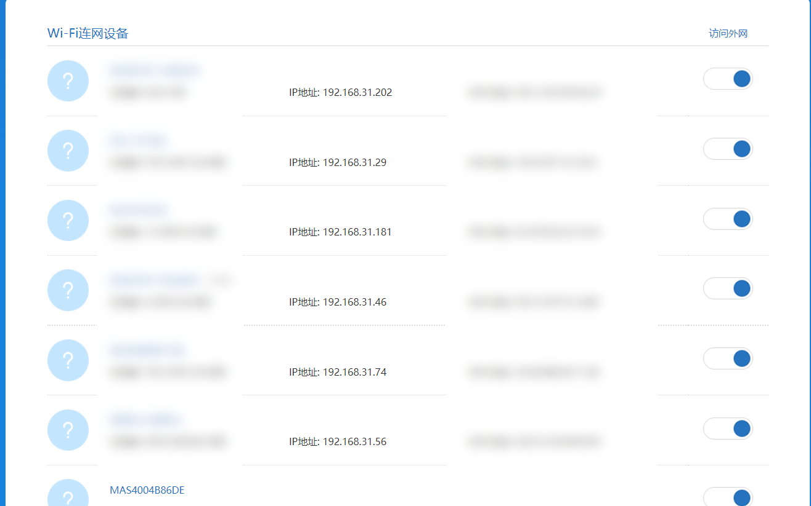
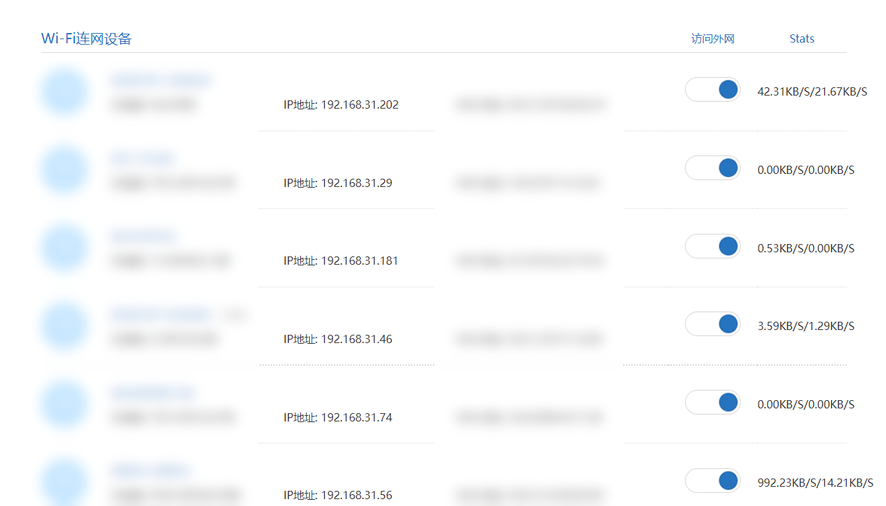

# MI Router Extension
Chrome extension to show upload and download speed on the list of devices shown by the router page. Download speed and upload speed already given by the router apis but they are not shown in a convenient way.

Before:

After:

